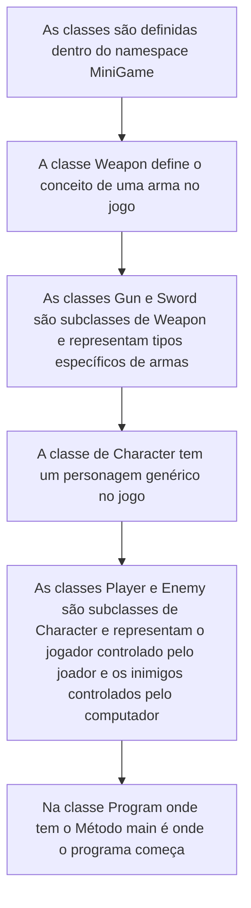

```mermaid
  flowchart TD;
      A[As classes são definidas dentro do namespace MiniGame]-->B[A classe Weapon define o conceito de uma arma no jogo];
      B-->C[As classes Gun e Sword são subclasses de Weapon e representam tipos específicos de armas];
      C-->D[A classe de Character tem um personagem genérico no jogo];  
      D-->E[As classes Player e Enemy são subclasses de Character e representam o jogador controlado pelo joador e os inimigos controlados pelo computador];
      E-->F[Na classe Program onde tem o Método main é onde o programa começa];
 
```
